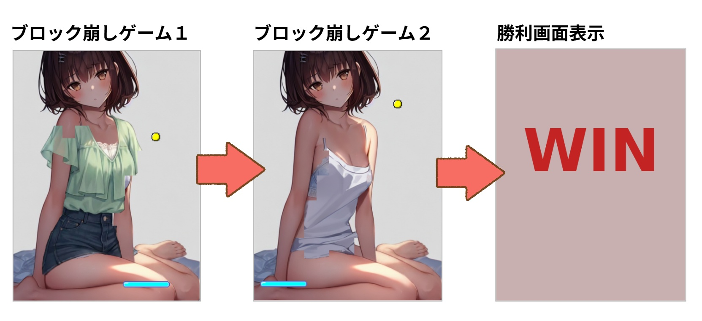
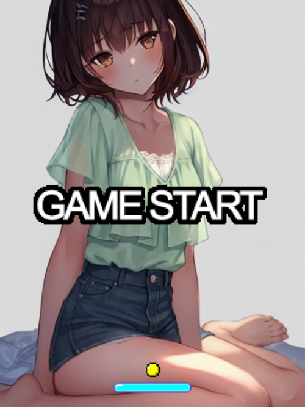
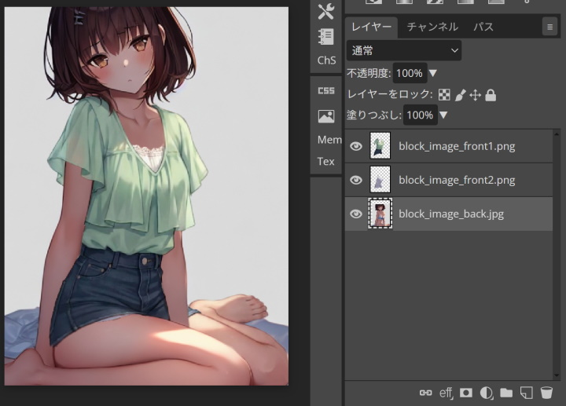

# 脱衣ブロック崩し
# 爆裂ブロック 重ね着バージョン

[](https://bakuretuken.github.io/bakuretu-block/)

1999年に作成した Java Applet版「脱衣ブロック崩し」を JavaScript でリメイクした、シンプルな脱衣ブロック崩しゲームです。

PC、スマートフォンの両方でゲームが遊べます。<br />
反射パネルのちょうど中心にボールを当てると、ボールが赤くなり「爆裂貫通弾」となります。（当時のApplet版の仕様そのまま）

**「重ね着バージョン」では、最初のブロックゲームをクリアすると、新しいブロックゲームが始まります。**<br />
**２回のブロック崩しゲームをクリアすると、勝利画像が表示されます。**



↓画像クリックでゲーム開始

[](https://bakuretuken.github.io/bakuretu-block2/)

## 概要

- PC・スマートフォン両対応
- 反射パネルの中心でボールを当てると「爆裂貫通弾」になる特別仕様
- 画像を差し替えるだけで簡単にカスタマイズ可能
- MITライセンスで自由に利用・改造OK

## ファイル構成

| ファイル名                | 説明                       |
|---------------------------|----------------------------|
| bakuretublock200.js       | ゲーム本体                 |
| bakuretublock201.min.js   | ゲーム本体(圧縮版)          |
| enchant.min.js            | enchant.jsゲームエンジン   |
| index.html                | ゲーム起動用HTML           |
| block_icon_boll.png       | ボール画像（44x22）        |
| block_icon_menu.png       | タイトル画像（512x256）    |
| block_icon_panel.png      | 反射パネル画像（120x32）   |
| block_image_back.jpg      | 背景画像（480x640）        |
| block_image_front1.png     | ブロック画像1（480x640, 透明PNG）|
| block_image_front2.png     | ブロック画像2（480x640, 透明PNG）|
| block_image_win.jpg       | 勝利画像（480x640）        |
| block_image.psd           | サンプルゲーム画像PSD            |

## セットアップ・使い方

1. ファイル一式をWebサーバーにアップロード
2. `index.html`をブラウザで開く
   ※ローカルPCでは画像読み込み制限で動作しないので、WEBサーバー上で動作確認してください（WEBサーバ経由で動作させてください）
3. 画像を差し替える場合は、同じファイル名・サイズで用意

## 画像を変更する方法

画像は背景画像、勝利画像が JPEG フォーメットで、それ以外は  PNG フォーマットです。<br />
自分で画像を用意する場合は同じファイルで、同じ画像サイズでファイルを用意してください。<br />
ブロック画像は「透明PNG」で用意してください。透明部分はブロックになりません。

**画面の縦横サイズは設定した「ブロックサイズ」の倍数にしてください。**<br />
※ブロックサイズは 16 か 32 のみ設定可能です。`index.html`で設定します。

```js
var BLOCK_GAME_BLOCK_SIZE = 32;     // ブロックサイズ（16 or 32）
```

ゲーム画像はレイヤー機能がある画像ソフトでの作成をおすすめします。



## ゲームのカスタマイズ

`index.html`で以下の変数を上書き可能
```js
var BLOCK_GAME_WIDTH = 480; // ゲーム画面幅（ブロック幅の倍数のみ設定可能）
var BLOCK_GAME_HEIGHT = 640; // ゲーム画面高さ（ブロック幅の倍数のみ設定可能）
var BLOCK_GAME_FPS = 24; // フレームレート
var BLOCK_GAME_BALL_SPEED = 10; // ボールの速度
var BLOCK_BAR_MARGIN_BOTTOM = 80; // 画面下からの反射パネルの高さ
var BLOCK_GAME_BLOCK_SIZE = 32; // ブロック幅（16 or 32）
var BLOCK_GAME_MIN_BLOCK_PIXEL = 100; // ブロック化最小ピクセル数（これ以下のピクセル数はブロック化しない）
```

透明部分がほとんどのブロック生成を避けるために、ブロック内のピクセルが BLOCK_GAME_MIN_BLOCK_PIXEL 以下の場合はブロック化しません。

## ゲームプログラムの改造

`index.html`の読み込みJSを`bakuretublock201.min.js`から下記に変更してください

```
<script src="bakuretublock201.js"></script>
```

`bakuretublock.js`を変更してください。<br />
`enchant.js`というゲームエンジンを使用しています。

手元のPCでWEBサーバを立ち上げるなどして、サーバ経由で動作確認を行ってください。<br />
ローカルでWEBサーバ起動可能な開発プログラム言語もあります。

```bash
# Python 3の場合
python -m http.server 8000

# Node.jsの場合
npx http-server -p 8000

# PHPの場合
php -S localhost:8000
```

## 注意事項

- 画像を更新したのに反映されない場合は、ブラウザのキャッシュをクリアしてください（スーパーリロード/強制更新してください）
- ブロック画像は「透明PNG」で、透明部分以外が「ブロック」になります

## 関連リンク

- [解説WEBページ](https://bakuretuken.com/block/)
- [サンプルゲーム](https://bakuretuken.github.io/bakuretu-block2/)

## ライセンス

- 本ゲームプログラム・画像はMITライセンスです。自由にご利用ください。自由に改造してください。
- 使用しているゲームエンジン [enchant.js](https://github.com/wise9/enchant.js/) もMITライセンスです

## クレジット
bakuretuKen 2014-2025

---
@see https://bakuretuken.com/block/
