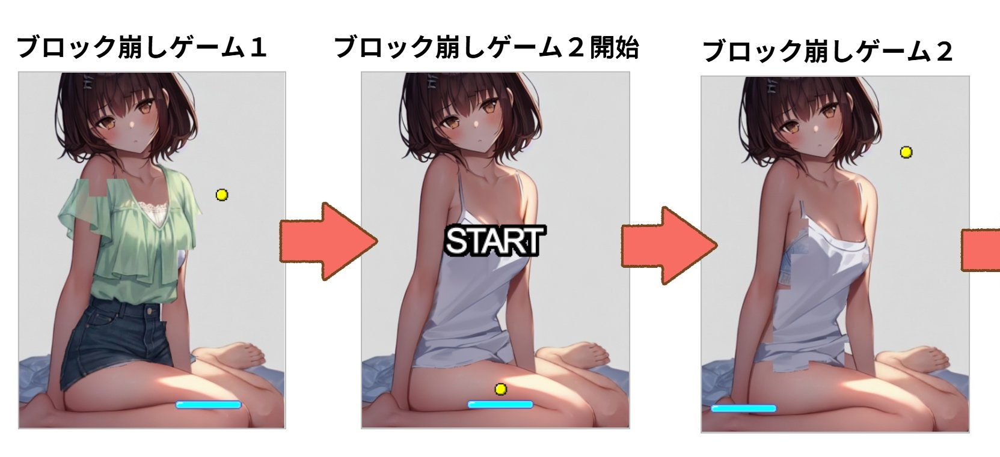
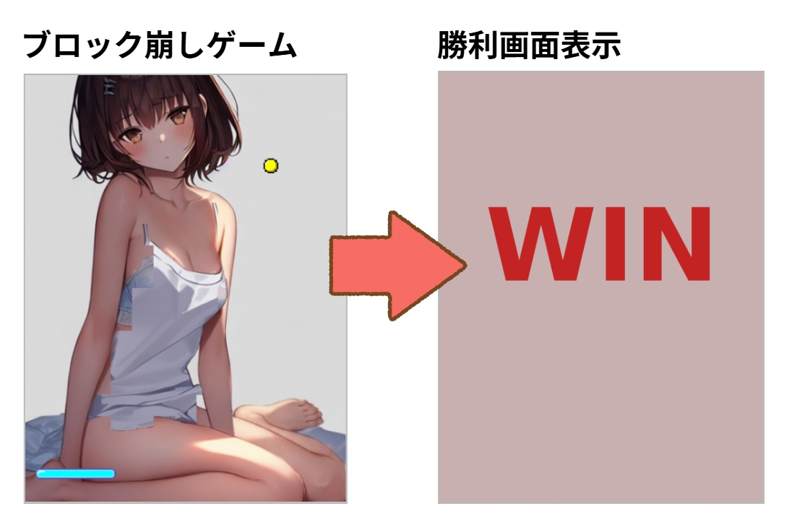
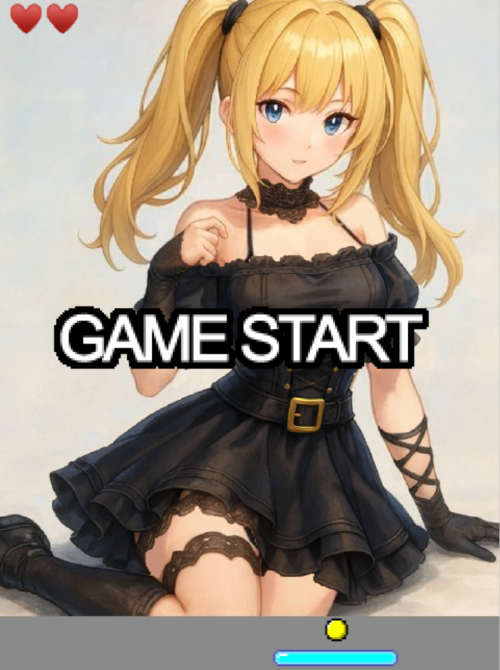
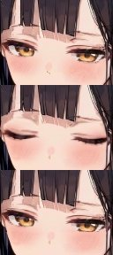

# 脱衣ブロック崩し「爆裂ブロック」重ね着バージョン

[](https://bakuretuken.github.io/bakuretu-block/)

1999年に作成した Java Applet版「脱衣ブロック崩し」を JavaScript でリメイクした、シンプルな脱衣ブロック崩しゲームです。

PC、スマートフォンの両方でゲームが遊べます。<br />
反射パネルのちょうど中心にボールを当てると、ボールが赤くなり「爆裂貫通弾」となります。（当時のApplet版の仕様そのまま）

**「重ね着バージョン」では、最初のブロックゲームをクリアすると、新しいブロックゲームが始まります。**<br />
**２回のブロック崩しゲームをクリアすると、勝利画像が表示されます。**


↓画像クリックでゲーム開始

[](https://bakuretuken.github.io/bakuretu-block2/)

## 概要

- PC・スマートフォン両対応
- 反射パネルの中心でボールを当てると「爆裂貫通弾」になる特別仕様
- 画像を差し替えるだけで簡単にカスタマイズ可能
- MITライセンスで自由に利用・改造OK

## ファイル構成

| ファイル名                | 説明                       |
|---------------------------|----------------------------|
| bakuretublock208.js       | ゲーム本体 v2.08           |
| enchant.min.js            | enchant.jsゲームエンジン   |
| index.html                | ゲーム起動用HTML           |
| block_icon_boll.png       | ボール画像（44x22）        |
| block_icon_menu.png       | タイトル画像（512x256）    |
| block_icon_panel.png      | 反射パネル画像（120x32）   |
| block_icon_life.png      | ライフ表示画像（30x30）   |
| block_image_back.jpg      | 背景画像（480x640）        |
| block_image_front1.png     | ブロック画像1（480x640, 透明PNG）|
| block_image_front2.png     | ブロック画像2（480x640, 透明PNG）(*1)|
| block_image_win.jpg       | 勝利画像（480x640）        |
| block_image.psd           | サンプルゲーム画像PSD            |

| フォルダ名                | 説明                       |
|---------------------------|----------------------------|
| 1block_game フォルダ      | 1段階ゲーム（通常バージョン）    |
| anime_game フォルダ      | アニメーション機能を使用したゲーム |

(*1) `BLOCK_GAME_SCREEN = 2` 2段階ゲーム（重ね着バージョン）の時のみ必要

## セットアップ・使い方

1. ファイル一式をWebサーバーにアップロード
2. `index.html`をブラウザで開く<br />
   ※ローカルPCでは画像読み込み制限で動作しないので、WEBサーバー上で動作確認してください（WEBサーバ経由で動作させてください）
3. 画像を差し替える場合は、同じファイル名・サイズで用意

## 画像を変更する方法

画像は背景画像、勝利画像が JPEG フォーメットで、それ以外は  PNG フォーマットです。<br />
自分で画像を用意する場合は同じファイルで、同じ画像サイズでファイルを用意してください。<br />
ブロック画像は「透明PNG」で用意してください。透明部分はブロックになりません。

**画面の縦横サイズは設定した「ブロックサイズ」の倍数にしてください。**<br />
※ブロックサイズは 16 か 32 のみ設定可能です。`index.html`で設定します。

```js
var BLOCK_GAME_BLOCK_SIZE = 32;     // ブロックサイズ（16 or 32）
```

ゲーム画像はレイヤー機能がある画像ソフトでの作成をおすすめします。


# ゲームのカスタマイズ

## 重ね着バージョン（2段階ゲーム）

`index.html`で以下の変数を設定してください
```js
var BLOCK_GAME_SCREEN = 2; // ゲーム数（1 or 2）
var BLOCK_GAME_WIDTH = 480; // ゲーム画面幅（ブロック幅の倍数のみ設定可能）
var BLOCK_GAME_HEIGHT = 640; // ゲーム画面高さ（ブロック幅の倍数のみ設定可能）
var BLOCK_GAME_LIFE = 3; // ライフ数（画面左上に残りライフ数が表示されます）
var BLOCK_GAME_FPS = 24; // フレームレート
var BLOCK_GAME_BALL_SPEED = 10; // ボールの速度
var BLOCK_BAR_MARGIN_BOTTOM = 80; // 画面下からの反射パネルの高さ
var BLOCK_GAME_BLOCK_SIZE = 32; // ブロック幅（16 or 32）
var BLOCK_GAME_MIN_BLOCK_PIXEL = 100; // ブロック化最小ピクセル数（これ以下のピクセル数はブロック化しない）
var BLOCK_NEXT_STAGE_START_SCREEN = 0; // ゲーム2開始時にSTART画面表示するかどうか（0:表示しない, 1:表示する）
```

透明部分がほとんどのブロック生成を避けるために、ブロック内のピクセルが `BLOCK_GAME_MIN_BLOCK_PIXEL` 以下の場合はブロック化しません。<br />
残りライフ数が左上にハートマークで表示されます。

`BLOCK_GAME_SCREEN = 2` で、ブロックゲームが2段階（重ね着バージョン）になります。

```js
var BLOCK_GAME_SCREEN = 2;
```

「重ね着バージョン」では、「ゲーム1」がクリアしたら「ゲーム2」が連続で始まるようになっています。<br />
ゲーム1がクリアしたらゲーム2が始まる前に、スタート画面を表示する場合は `BLOCK_NEXT_STAGE_START_SCREEN = 1` にしてください（v2.06a以降）。

```js
var BLOCK_NEXT_STAGE_START_SCREEN = 1;
```



------------------------------------------------------------

## 通常バージョン（1段階ゲーム）

`1block_game`フォルダに通常バージョンのゲームがあります。



`index.html`で以下の変数を設定してください
```js
var BLOCK_GAME_SCREEN = 1; // ゲーム数（1 or 2）
var BLOCK_GAME_WIDTH = 480; // ゲーム画面幅（ブロック幅の倍数のみ設定可能）
var BLOCK_GAME_HEIGHT = 640; // ゲーム画面高さ（ブロック幅の倍数のみ設定可能）
var BLOCK_GAME_LIFE = 3; // ライフ数（画面左上に残りライフ数が表示されます）
var BLOCK_GAME_FPS = 24; // フレームレート
var BLOCK_GAME_BALL_SPEED = 10; // ボールの速度
var BLOCK_BAR_MARGIN_BOTTOM = 80; // 画面下からの反射パネルの高さ
var BLOCK_GAME_BLOCK_SIZE = 32; // ブロック幅（16 or 32）
var BLOCK_GAME_MIN_BLOCK_PIXEL = 100; // ブロック化最小ピクセル数（これ以下のピクセル数はブロック化しない）
```

`BLOCK_GAME_SCREEN = 1` で、ブロックゲームが1段階（通常バージョン）になります。<br />
通常バージョンでは「ブロック画像2（block_image_front2.png）」のPNGファイルは不要です。

```js
var BLOCK_GAME_SCREEN = 1;
```

↓画像クリックでゲーム開始

[](https://bakuretuken.github.io/bakuretu-block/)

------------------------------------------------------------

## [オプション] アニメーション機能

`anime_game`フォルダに「アニメーション機能を使用したゲーム」があります。

通常版、重ね着バージョンの両方で、アニメーション機能を使用できます。

`index.html`で以下の変数を設定を追加してください。
```js
・・・省略・・・
var BLOCK_GAME_ANIME_IMAGE = 5; // アニメーション画像枚数（アニメ機能利用）
var BLOCK_GAME_ANIME_POSITION_X = 125; // アニメーション画像X位置
var BLOCK_GAME_ANIME_POSITION_Y = 36; // アニメーション画像Y位置
var BLOCK_GAME_ANIME_FRAME = 1; // アニメーション画像切り替えフレーム数
var BLOCK_GAME_ANIME_WAIT = 90; // アニメーション待ちフレーム数
```

`BLOCK_GAME_ANIME_IMAGE` で「アニメーション画像枚数」を設定することでアニメーション機能を使用できます。<br />
「block_image_anime.jpg」画像を用意してください。<br />
画像は「アニメーション画像枚数」分の画像を縦に並べてください。<br />
画像はJPEGフォーマットで用意してください。（縦横の画像サイズは8の倍数を推奨）

```js
var BLOCK_GAME_ANIME_IMAGE = 5;
```

**block_anime.jpg**



アニメーション画像の表示位置を下記で設定します。

```js
var BLOCK_GAME_ANIME_POSITION_X = 125;
var BLOCK_GAME_ANIME_POSITION_Y = 36;
```

`BLOCK_GAME_ANIME_FRAME` で「アニメーションフレーム間隔」を設定することでアニメーション速度を調整できます（フレーム設定）<br />
設定数が大きいほどアニメーション速度が早くなります。

`BLOCK_GAME_ANIME_WAIT` で「アニメーション待ち時間」を設定することでアニメーションの待ち時間を調整できます（フレーム設定）<br />
待ち時間が大きいほどアニメーションとアニメーションの間隔が長くなります。

上記の設定だと、90フレーム経つと5枚のアニメーション画像が1フレーム間隔で表示されます。そして、また90フレームの待ちに入ります。<br />
表示座標位置は (125, 36) です。

**↓** リンククリックでゲーム開始。目がアニメーションします。

[**アニメーション ゲーム開始**](https://bakuretuken.github.io/bakuretu-block2a/)

【特記事項】<br />
正しい大きさでアニメ画像を作っても表示画像サイズがズレて表示されてしまう場合は、JPEG の DPI の問題の可能性が高いです。すべての JPEG画像の DPI を 72 に設定してください。

------------------------------------------------------------

## ゲームプログラムの改造

`index.html`で読み込んでいる JSプログラム `bakuretublock208.js`を改造してください

```
<script src="bakuretublock208.js"></script>
```

`enchant.js`というゲームエンジンを使用しています。

ゲームを実行するにはWEBサーバ経由で実行する必要があります。<br />
ホームページを公開している場合は、ホームページ経由でゲームを実行してください。<br />
手元のPCでWEBサーバを立ち上げるなどして、サーバ経由で動作確認も可能です。<br />
ローカルでWEBサーバ起動可能な開発プログラム言語もあります。

```bash
# Python 3の場合
python -m http.server 8000

# Node.jsの場合
npx http-server -p 8000

# PHPの場合
php -S localhost:8000
```

### ゲーム状態（game.mode）

| 値 | 定数名 | 説明 |
|-----|-----|-----|
| 0 | GAME_MODE.WAIT | 初期状態。ゲーム開始待ち |
| 1 | GAME_MODE.PLAY1 | ゲーム1プレイ中。通常バージョンのゲーム |
| 2 | GAME_MODE.PLAY2 | ゲーム2プレイ中。重ね着バージョンのゲーム |
| 9 | GAME_MODE.LOSE | 敗北。ゲームが敗北した状態 |
| 10 | GAME_MODE.WIN | 勝利。ゲームが勝利した状態 |
| 11 | GAME_MODE.CONTINUE1 | ゲーム1再開待ち。ゲーム1でミスして再開待ちの状態 |
| 12 | GAME_MODE.CONTINUE2 | ゲーム2再開待ち。ゲーム2でミスして再開待ちの状態 |

11、12 はライフ数が1の場合は遷移されません（敗北(9)に遷移します）

- 重ね着バージョン（2段階ゲーム）の遷移パターン例
    - 0 → 1 → 11 → 1 → 9
    - 0 → 1 → 11 → 1 → 2 → 12 → 2 → 9 or 10
- 重ね着バージョン（2段階ゲーム）の遷移パターン例（ゲーム2開始前にSTART画面を表示）
    - 0 → 1 → 11 → 1 → 12 → 2 → 12 → 2 → 9 or 10

- 通常バージョン（1段階ゲーム）の遷移パターン例
    - 0 → 1 → 11 → 1 → 9 or 10

## 注意事項

- 画像を更新したのに反映されない場合は、ブラウザのキャッシュをクリアしてください（スーパーリロード/強制更新してください。WEBサーバの設定でブラウザキャッシュされているケースもあります）
   - SHIFT + Ctrl + R (Windows)
   - Shift + Command + R (Mac)
- ブロック画像は「透明PNG」で、透明部分以外が「ブロック」になります

## 特記事項

- ver2.05b以前のプログラムでは「重ね着バージョンゲーム」にバグ（プログラム不具合）があります。最新版（ver2.06以降）を使用してください。

## 関連リンク

- [解説WEBページ](https://bakuretuken.com/block/)
- [2段階サンプルゲーム](https://bakuretuken.github.io/bakuretu-block2/)
- [1段階サンプルゲーム](https://bakuretuken.github.io/bakuretu-block/)

## ライセンス

- 本ゲームプログラム・画像はMITライセンスです。自由にご利用ください。自由に改造してください。
- 使用しているゲームエンジン [enchant.js](https://github.com/wise9/enchant.js/) もMITライセンスです

---

bakuretuKen 2014-2026 <br />
@see https://bakuretuken.com/block/
